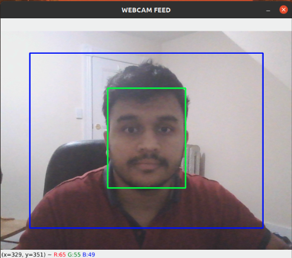
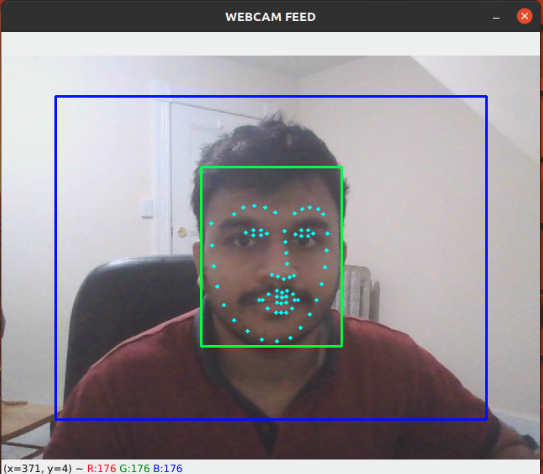

# Real-time Head Pose Estimation

The following repository contains the code for head pose tracking. This can be used by various online platforms for proctoring.

## Description 
Head pose estimation is a challenging problem because of the various steps required to solve it. Head pose is an important cue in computer vision when using facial information. Firstly, we need to locate the face in the frame and then the various facial landmarks. In this project, real time human head pose estimation using TensorFlow and OpenCV has been implemented
## Getting Started
### Face detection
First step is to find the faces in the images on which we can find facial landmarks.Initially Haar Cascade Face Detector was used. However, it fails to detect side faces. Dlib's frontal face HOG detector did not give very good results as well. For this task, 8 bit quantized tensorflow model of OpenCV’s DNN module is used. It is based on Single-Shot-Multibox detector and uses ResNet-10 Architecture as backbone.


### Face landmark detection
Initially Dlib's facial landmark model was used, but failed to perform well for side faces.Later, facial landmarks detection based on convolution neural network was implemented. It provides 68 landmarks on the face. Here is a sample image showing the detection result.


### Pose estimation
Pose of an object refers to its relative orientation and position with respect to a camera. For this project, the nose tip, chin, extreme left and right points of lips, and the left corner of the left eye and right corner of the right eye are the six points of the face that we need. We estimate the rational and translational vectors at the nose tip using standard 3D coordinates of these facial landmarks. We can project those 3D points onto a 2D surface, which is our image, after we have the needed vectors.

### Dependencies

* OS version: Windows 10/11 or Ubuntu or Mac OS
* Coding Environment: VS Code or PyCharm or any other suitable coding playform to run python
* Python Version 3.8.10
* TensorFlow Version 2.7.0


For more necessary packages please refer to packages.txt in the repository
```
pip install -r requirements.txt
```

### Installing
1. Clone the project repository: `git clone https://github.com/Ashwij3/Head_pose_tracker.git`
2. Before running install all the necessary dependencies in your coding environment using terminal.

### Executing program
* Sit facing the camera and execute the program with the following command:
```
cd Head_pose_tracker/scripts
python3 main.py
```
